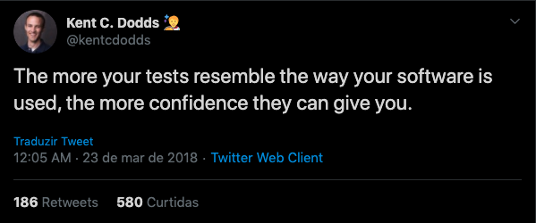

https://www.infoq.com/br/presentations/enzyme-para-react-testing-library/

https://www.youtube.com/watch?v=hFm0enk-qfM


- Escrever sobre a importância de escrever testes (linkar com citações de artigos do Kent Beck/Martin Fowler)

- Falar sobre a dor de testar aplicações Front-end

- Fazer uma breve comparação com o Enzyme, citando algumas dores ao usar essa lib para testar


- Falar sobre a mudança de conceito/paradigma que o Testing Library introduz

- Escrever uma aplicação simples e testá-la (colocar exemplos no Codesandbox)

- Citar o Kent C Dodds (blog, Twitter)

- Testing Library for testing React components, que tem como principio encourages better testing practices

## Testes "melhores" ? 
### O que exatamente isto significa ? O que faz um teste ser "bom" ?

Para responder essa pergunta, é necessário primeiro questionar algo que parece básico: **_Porque devemos escrever testes?_**.

Em primeiro lugar, uma das principais razões que se dá pelo fato de que os testes nos dão uma confiança maior de que o software (ainda) funciona. Essa segurança ainda se estende quando é necessário fazer uma manutenção, no qual os testes nos dão os primeiros "sinais de fumaça" que algo pode estar errado. Existem outras inúmeras razões para escrever testes, e como dica pessoal eu indico ler [este artigo do Kent Beck](https://medium.com/@kentbeck_7670/programmer-test-principles-d01c064d7934).

Porém, não é interessante que os testes exijam:
- Grande curva de aprendizado;
- Muito esforço para escrever e executar;
- Esforço para manter

#### Em resumo, bons testes são aqueles que nos dão uma boa confiança, sem ter uma grande curva de aprendizado e que não tenham muito esforço para escrever, executar e manter.

Então, vamos à um exemplo do que **NÃO** seria um teste bom (na minha opinião), e depois veremos como o Testing Library talvez possa nos ajudar a escrever um teste melhor.

```javascript
it('renders a button in size of "small" with a text on it', () => {
  const wrapper = shallow(
    <Button size="small" text="Join us" />
  );

  expect(wrapper.find('button').prop('size')).toBe('small');
  expect(wrapper.find('button').prop('text')).toBe('Join us');
});
```
#### Você deve estar se perguntando, mas o que tem de errado neste teste ? Porque é um teste "ruim" ?


The Testing Library is a very light-weight solution for testing React components. Its provides light utility functions on top of react-dom and react-dom/test-utils, in a way that encourages better testing practices. It's primary guiding principle is:



Em poucas palavras, a Testing Library provê algumas [`Queries`](https://testing-library.com/docs/dom-testing-library/api-queries) para interagir com os elementos da árvore DOM. Também vale lembrar do [`@testing-library/jest-dom`](https://github.com/testing-library/jest-dom#table-of-contents), que fornece um conjunto de asserções personalizados do Jest. Isso tornará seus testes mais declarativos, claros para leitura e manutenção.

```jsx
  // Link Component
  const Link = () => (
    <a href="/about">About ℹ️</a>
  )

  // Link.test.js
  import { render } from '@testing-library/react'

  const { getByText } = render(<Link />)
  expect(getByText(/about/i)).toBeInTheDocument();
```


> "Hello, friend?" That's lame. Maybe I should give you a name...\
> But that's a slippery slope.\
> You're only in my head.\
> We have to remember that...\
> Shit.\
> It's actually happened.\
> I'm talking to an imaginary person.
>
> **— Mr. Robot S01E01**
